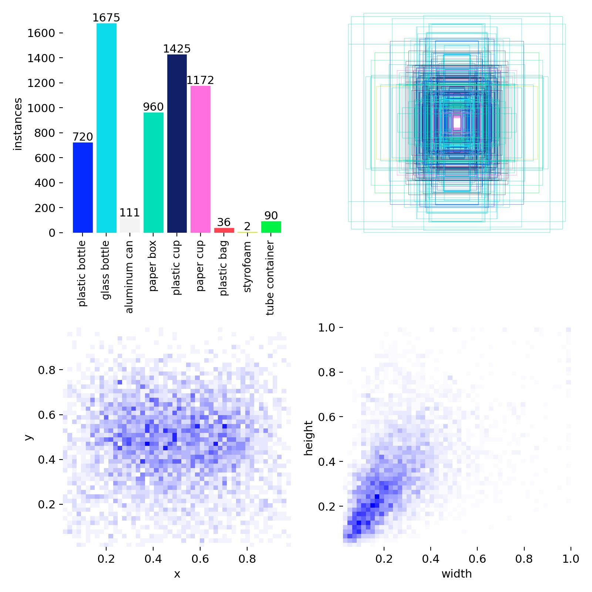

# label: YOLO-World 기반 재활용품 이미지 자동 라벨링

**날짜** 2026-04-02 (목) 13:05:28
**브랜치** `main`
**타입** `label`

> 관련 파일: `[2-1] yolo auto-labeling.ipynb`

## 가설

YOLO-World의 오픈 보캐블러리 탐지 기능으로 수작업 없이 재활용품 이미지에 YOLO 형식 라벨을 자동 생성할 수 있다

## 설정

- YOLOv8s-World
- 재활용품 9개 클래스 정의 (plastic bottle, glass bottle, aluminum can, paper box, plastic cup, paper cup, plastic bag, styrofoam, tube container)
- conf=0.1 (저신뢰도 허용, 최대한 많이 탐지)
- YOLO 트랙(`class == 'YOLO'`) 이미지만 처리

## 결과

yolo/images/train(1,747장) / yolo/images/val(3,144장) 이미지 복사, yolo/labels/{train,val}/ 라벨 .txt 파일 생성, dataset.yaml 자동 생성

### 라벨 분포 (labels.jpg)

클래스별 인스턴스 수:

| 클래스 | 건수 |
|---|---|
| glass bottle | 1,675 |
| paper box | 1,425 |
| plastic cup | 1,172 |
| plastic bottle | 720 |
| aluminum can | 960 |
| tube container | 90 |
| paper cup | 36 |
| plastic bag | 2 |

## 판단

자동 라벨링 완료. 단, labels.jpg로 확인한 클래스 분포에서 plastic bag(2건)·styrofoam(90건) 등 극소 클래스가 존재하며, 이 불균형은 이후 어떤 단계에서도 재라벨링·오버샘플링·클래스 가중치 조정 등으로 보정되지 않음
